# SentientFlow

**한국어** | [English](./README.md)

> [Sentient Agent Framework](https://github.com/sentient-agi/Sentient-Agent-Framework) 기반 AI 에이전트 시각적 워크플로우 빌더

SentientFlow는 직관적인 드래그 앤 드롭 인터페이스를 통해 AI 에이전트 워크플로우를 생성, 구성 및 실행할 수 있는 오픈소스 시각적 워크플로우 빌더입니다. 코드 작성 없이 복잡한 에이전트 파이프라인을 구축하세요.

[](https://opensource.org/licenses/MIT)
[](https://nextjs.org/)
[](https://fastapi.tiangolo.com/)
[](https://github.com/sentient-agi/Sentient-Agent-Framework)
[](https://openai.com/)

## ✨ 주요 기능

### 핵심 기능
- **🎨 시각적 캔버스**: ReactFlow 기반 드래그 앤 드롭 인터페이스로 워크플로우 구축
- **🤖 AI 에이전트 노드**: 사용자 정의 프롬프트와 매개변수로 LLM 기반 에이전트 구성
- **🔀 로직 제어**: 조건 분기(If/Else), 루프(While), 사용자 승인
- **📊 데이터 변환**: CEL 표현식으로 워크플로우 단계 간 데이터 변환
- **🔌 도구 통합**: 파일 검색, 가드레일, MCP 서버 통합
- **⚡ 실시간 스트리밍**: SSE를 통한 LLM 응답 실시간 스트리밍
- **💾 워크플로우 저장**: Zustand 상태 관리로 워크플로우 저장 및 불러오기

### 프레임워크 & AI 기능
- **🧠 GPT-5 지원**: 설정 가능한 추론 노력(낮음/중간/높음)과 함께 완전한 GPT-5 통합
- **🔍 사고 과정 투명성**: 접을 수 있는 섹션에서 에이전트의 추론 과정 확인
- **🔗 다중 에이전트 워크플로우**: 자동 변수 전달로 여러 에이전트 연결
- **📡 이벤트 스트리밍**: 단조 증가하는 ULID 순서를 가진 프레임워크 호환 SSE 이벤트
- **✅ 프레임워크 준수**: Sentient Agent Framework v0.3.0과 100% 호환
- **🧪 테스트 완료**: 프레임워크 통합을 검증하는 포괄적인 테스트 스위트 (14개 테스트)

## 🏗️ 아키텍처

```mermaid
graph TB
    subgraph Frontend["프론트엔드 (Next.js 16)"]
        A[시각적 캔버스<br/>ReactFlow]
        B[노드 속성<br/>패널]
        C[실행 패널<br/>SSE 스트림]
    end

    subgraph Backend["백엔드 (FastAPI)"]
        D[워크플로우 컴파일러]
        E[워크플로우 에이전트<br/>AbstractAgent]
        F[노드 실행기]
    end

    subgraph External["외부 서비스"]
        G[Sentient Framework]
        H[OpenAI API]
    end

    A -->|워크플로우 JSON| D
    D -->|컴파일됨| E
    E -->|실행| F
    F -->|SSE 이벤트| C
    E --> G
    F --> H

    style Frontend fill:#1a1a2e
    style Backend fill:#16213e
    style External fill:#0f3460
```



## 🚀 빠른 시작

### 사전 요구 사항

- **Node.js 18+** 및 **npm**
- **Python 3.9+** 및 **pip**
- **OpenAI API 키**

### 방법 1: 자동 설정 (권장)

**의존성 설치:**
```bash
# Mac/Linux
./install.sh

# Windows
install.bat

# 또는 npm 사용
npm install
```

**API 키 설정:**
```bash
cp backend/.env.example backend/.env
# backend/.env 파일을 열어 OPENAI_API_KEY 추가
```

**서버 실행:**
```bash
# Mac/Linux
./start.sh

# Windows
start.bat

# 또는 npm 사용
npm start
```

프론트엔드: `http://localhost:3000` | 백엔드: `http://localhost:8000`

### 방법 2: 수동 설정

**프론트엔드:**
```bash
cd frontend
npm install
npm run dev  # http://localhost:3000에서 실행
```

**백엔드:**
```bash
cd backend
python3 -m venv venv
source venv/bin/activate  # Windows: venv\Scripts\activate
pip install -r requirements.txt

# 환경 변수 설정
cp .env.example .env
# .env 파일을 열어 OPENAI_API_KEY 추가

# 서버 시작
python main.py  # http://localhost:8000에서 실행
```

### 첫 번째 워크플로우 만들기

1. `http://localhost:3000/workflow/test`로 이동
2. **노드 추가**: 왼쪽 패널에서 Agent 노드를 캔버스에 드래그
3. **노드 연결**: Start → Agent → End로 엣지 연결
4. **설정**: Agent 노드를 클릭하여 프롬프트와 매개변수 편집
5. **실행**: 실행 패널에서 "Run Workflow" 버튼 클릭
6. **확인**: LLM 응답이 실시간으로 스트리밍되는 것을 확인하세요!

## 🎯 노드 타입

| 카테고리 | 노드 타입 | 설명 |
|----------|-----------|-------------|
| **핵심** | Start | 워크플로우 진입점, 변수 초기화 |
| | Agent | 설정 가능한 프롬프트를 가진 LLM 기반 에이전트 |
| | End | 워크플로우 종료 지점 |
| | Note | 주석 및 메모 |
| **도구** | File Search | 파일 검색 및 내용 가져오기 |
| | Guardrails | 콘텐츠 검증 및 필터링 |
| | MCP | Model Context Protocol 서버 통합 |
| **로직** | If/Else | CEL 표현식을 사용한 조건 분기 |
| | While | 조건을 사용한 루프 실행 |
| | User Approval | 사람이 개입하는 승인 게이트 |
| **데이터** | Transform | CEL 표현식을 사용한 데이터 변환 |
| | Set State | 변수 할당 및 상태 업데이트 |

## 📦 기술 스택

### 프론트엔드
- **프레임워크**: Next.js 16 (App Router), React 19
- **UI 라이브러리**: ReactFlow 12.9 (시각적 캔버스)
- **상태 관리**: Zustand 5.0
- **스타일링**: Tailwind CSS v4
- **폼 처리**: React Hook Form + Zod 검증
- **아이콘**: Lucide React

### 백엔드
- **프레임워크**: FastAPI 0.115
- **에이전트 엔진**: Sentient Agent Framework 0.3
- **LLM**: OpenAI API 1.59
- **표현식 엔진**: CEL (cel-python 0.4.0)
- **검증**: Pydantic 2.10
- **서버**: Uvicorn 0.34

## 📂 프로젝트 구조

```
sentientFlow/
├── frontend/              # Next.js 프론트엔드 애플리케이션
│   ├── app/              # Next.js App Router 페이지
│   ├── components/       # React 컴포넌트
│   │   ├── canvas/       # 캔버스 및 노드 컴포넌트
│   │   ├── execution/    # 실행 패널 컴포넌트
│   │   └── panels/       # 노드 팔레트 및 속성
│   ├── lib/              # 유틸리티 및 스토어
│   ├── types/            # TypeScript 타입 정의
│   └── hooks/            # 커스텀 React 훅
│
└── backend/              # FastAPI 백엔드 서비스
    ├── src/
    │   ├── workflows/    # 워크플로우 컴파일
    │   ├── agents/       # 노드 실행기
    │   ├── api/          # API 라우트
    │   └── tools/        # 도구 통합
    └── main.py           # 애플리케이션 진입점
```

## 🗺️ 로드맵

### ✅ Phase 1: 핵심 실행 엔진 (완료)
- [x] 12가지 노드 타입을 가진 시각적 워크플로우 빌더
- [x] Start → Agent → End 실행
- [x] 프레임워크 호환 실시간 SSE 스트리밍
- [x] 추론 투명성을 포함한 GPT-5 통합
- [x] 다중 에이전트 워크플로우 지원
- [x] Sentient Framework v0.3.0 준수 검증 완료
- [x] 포괄적인 테스트 스위트 (14개의 프레임워크 준수 테스트)

### ✅ Phase 2: 고급 노드 (완료)
- [x] Transform 노드 (CEL 표현식)
- [x] If/Else 노드 (조건부 로직)
- [x] While 노드 (루프)
- [x] SetState 노드 (변수 관리)

### 🔄 Phase 3: 도구 통합 (진행 중)
- [x] File Search 노드
- [x] MCP 서버 통합
- [x] Guardrails 노드
- [x] User Approval 노드
- [ ] 추가 도구 통합

### 📋 Phase 4: UX 향상 (계획됨)
- [ ] 워크플로우 템플릿
- [ ] 워크플로우 내보내기/가져오기
- [ ] 실행 기록
- [ ] 중단점이 있는 디버그 모드
- [ ] 자동완성 기능이 있는 변수 선택기

### 🔐 Phase 5: 다중 사용자 및 인증 (계획됨)
- [ ] 사용자 인증
- [ ] 사용자별 API 키
- [ ] 프로젝트 관리
- [ ] 다중 LLM 제공자 지원 (Anthropic, Gemini, Perplexity)

## 🤝 기여하기

기여를 환영합니다! 자세한 내용은 [CONTRIBUTING.md](./CONTRIBUTING.md)를 참조하세요.

1. 저장소 포크
2. 기능 브랜치 생성 (`git checkout -b feature/amazing-feature`)
3. 변경 사항 커밋 (`git commit -m 'Add amazing feature'`)
4. 브랜치에 푸시 (`git push origin feature/amazing-feature`)
5. Pull Request 생성

## 📄 라이센스

이 프로젝트는 MIT 라이센스를 따릅니다 - 자세한 내용은 [LICENSE](./LICENSE) 파일을 참조하세요.

## 🙏 감사의 말

- [Sentient Agent Framework](https://github.com/sentient-agi/Sentient-Agent-Framework) - 핵심 에이전트 실행 엔진
- [ReactFlow](https://reactflow.dev/) - 시각적 워크플로우 캔버스
- [FastAPI](https://fastapi.tiangolo.com/) - 고성능 Python 백엔드
- [Next.js](https://nextjs.org/) - 프로덕션용 React 프레임워크

## 📞 지원

- **이슈**: [GitHub Issues](https://github.com/hoddukzoa12/sentientFlow/issues)
- **토론**: [GitHub Discussions](https://github.com/hoddukzoa12/sentientFlow/discussions)

---

SentientFlow 커뮤니티가 ❤️로 만들었습니다
