# SentientFlow

[한국어](./README.ko.md) | **English**

> Visual Workflow Builder for AI Agents powered by [Sentient Agent Framework](https://github.com/sentient-agi/Sentient-Agent-Framework)

SentientFlow is an open-source visual workflow builder that lets you create, configure, and execute AI agent workflows through an intuitive drag-and-drop interface. Build complex agent pipelines without writing code.

[](https://opensource.org/licenses/MIT)
[](https://nextjs.org/)
[](https://fastapi.tiangolo.com/)

## ✨ Features

- **🎨 Visual Canvas**: Drag-and-drop interface powered by ReactFlow for building workflows
- **🤖 AI Agent Nodes**: Configure LLM-powered agents with custom prompts and parameters
- **🔀 Logic Controls**: Conditional branching (If/Else), loops (While), user approvals
- **📊 Data Transformation**: Transform data with CEL expressions between workflow steps
- **🔌 Tool Integration**: File search, guardrails, MCP server integration
- **⚡ Real-time Streaming**: See LLM responses stream in real-time via SSE
- **💾 Workflow Persistence**: Save and load workflows with Zustand state management

## 🏗️ Architecture



```mermaid
graph TB
    subgraph Frontend["Frontend (Next.js 16)"]
        A[Visual Canvas<br/>ReactFlow]
        B[Node Properties<br/>Panel]
        C[Execution Panel<br/>SSE Stream]
    end

    subgraph Backend["Backend (FastAPI)"]
        D[Workflow Compiler]
        E[Workflow Agent<br/>AbstractAgent]
        F[Node Executors]
    end

    subgraph External["External Services"]
        G[Sentient Framework]
        H[OpenAI API]
    end

    A -->|Workflow JSON| D
    D -->|Compiled| E
    E -->|Execute| F
    F -->|SSE Events| C
    E --> G
    F --> H

    style Frontend fill:#1a1a2e
    style Backend fill:#16213e
    style External fill:#0f3460
```

## 🚀 Quick Start

### Prerequisites

- **Node.js 18+** and **npm**
- **Python 3.9+** and **pip**
- **OpenAI API key**

### Option 1: Automated Setup (Recommended)

**Install dependencies:**
```bash
# Mac/Linux
./install.sh

# Windows
install.bat

# Or using npm
npm install
```

**Configure API key:**
```bash
cp backend/.env.example backend/.env
# Edit backend/.env and add your OPENAI_API_KEY
```

**Start both servers:**
```bash
# Mac/Linux
./start.sh

# Windows
start.bat

# Or using npm
npm start
```

Frontend: `http://localhost:3000` | Backend: `http://localhost:8000`

### Option 2: Manual Setup

**Frontend:**
```bash
cd frontend
npm install
npm run dev  # Runs at http://localhost:3000
```

**Backend:**
```bash
cd backend
python3 -m venv venv
source venv/bin/activate  # Windows: venv\Scripts\activate
pip install -r requirements.txt

# Configure environment
cp .env.example .env
# Edit .env and add your OPENAI_API_KEY

# Start server
python main.py  # Runs at http://localhost:8000
```

### Create Your First Workflow

1. Navigate to `http://localhost:3000/workflow/test`
2. **Add nodes**: Drag Agent node from left panel onto canvas
3. **Connect nodes**: Draw edges from Start → Agent → End
4. **Configure**: Click Agent node to edit prompts and parameters
5. **Execute**: Click "Run Workflow" in execution panel
6. **Watch**: See LLM responses stream in real-time!

## 🎯 Node Types

| Category | Node Type | Description |
|----------|-----------|-------------|
| **Core** | Start | Workflow entry point, initializes variables |
| | Agent | LLM-powered agent with configurable prompts |
| | End | Workflow termination point |
| | Note | Annotations and comments |
| **Tools** | File Search | Search and retrieve file contents |
| | Guardrails | Content validation and filtering |
| | MCP | Model Context Protocol server integration |
| **Logic** | If/Else | Conditional branching with CEL expressions |
| | While | Loop execution with conditions |
| | User Approval | Human-in-the-loop approval gates |
| **Data** | Transform | Data transformation with CEL expressions |
| | Set State | Variable assignment and state updates |

## 📦 Tech Stack

### Frontend
- **Framework**: Next.js 16 (App Router), React 19
- **UI Library**: ReactFlow 12.9 for visual canvas
- **State**: Zustand 5.0 for global state management
- **Styling**: Tailwind CSS v4
- **Forms**: React Hook Form + Zod validation
- **Icons**: Lucide React

### Backend
- **Framework**: FastAPI 0.115
- **Agent Engine**: Sentient Agent Framework 0.3
- **LLM**: OpenAI API 1.59
- **Expression Engine**: CEL (cel-python 0.4.0)
- **Validation**: Pydantic 2.10
- **Server**: Uvicorn 0.34

## 📂 Project Structure

```
sentientFlow/
├── frontend/              # Next.js frontend application
│   ├── app/              # Next.js App Router pages
│   ├── components/       # React components
│   │   ├── canvas/       # Canvas and node components
│   │   ├── execution/    # Execution panel components
│   │   └── panels/       # Node palette and properties
│   ├── lib/              # Utilities and stores
│   ├── types/            # TypeScript type definitions
│   └── hooks/            # Custom React hooks
│
└── backend/              # FastAPI backend service
    ├── src/
    │   ├── workflows/    # Workflow compilation
    │   ├── agents/       # Node executors
    │   ├── api/          # API routes
    │   └── tools/        # Tool integrations
    └── main.py           # Application entry point
```

## 🗺️ Roadmap

### ✅ Phase 1: Core Execution Engine (Current)
- [x] Visual workflow builder
- [x] Start → Agent → End execution
- [x] Real-time SSE streaming
- [x] OpenAI integration

### 🔄 Phase 2: Advanced Nodes (In Progress)
- [ ] Transform node (CEL expressions)
- [ ] If/Else node (conditional logic)
- [ ] While node (loops)
- [ ] SetState node (variable management)

### 📋 Phase 3: Tool Integration
- [ ] File Search node
- [ ] MCP server integration
- [ ] Guardrails node
- [ ] User Approval node

### 🎨 Phase 4: Enhanced UX
- [ ] Workflow templates
- [ ] Export/Import workflows
- [ ] Execution history
- [ ] Debug mode with breakpoints

### 🔐 Phase 5: Multi-User & Authentication
- [ ] Wallet login (Thirdweb)
- [ ] User-specific API keys
- [ ] Project management
- [ ] Multi-LLM provider support (Anthropic, Gemini, Perplexity)

## 🤝 Contributing

We welcome contributions! Please see [CONTRIBUTING.md](./CONTRIBUTING.md) for guidelines.

1. Fork the repository
2. Create your feature branch (`git checkout -b feature/amazing-feature`)
3. Commit your changes (`git commit -m 'Add amazing feature'`)
4. Push to the branch (`git push origin feature/amazing-feature`)
5. Open a Pull Request

## 📄 License

This project is licensed under the MIT License - see the [LICENSE](./LICENSE) file for details.

## 🙏 Acknowledgments

- [Sentient Agent Framework](https://github.com/sentient-agi/Sentient-Agent-Framework) - Core agent execution engine
- [ReactFlow](https://reactflow.dev/) - Visual workflow canvas
- [FastAPI](https://fastapi.tiangolo.com/) - High-performance Python backend
- [Next.js](https://nextjs.org/) - React framework for production

## 📞 Support

- **Issues**: [GitHub Issues](https://github.com/hoddukzoa12/sentientFlow/issues)
- **Discussions**: [GitHub Discussions](https://github.com/hoddukzoa12/sentientFlow/discussions)

---

Made with ❤️ by the SentientFlow community
